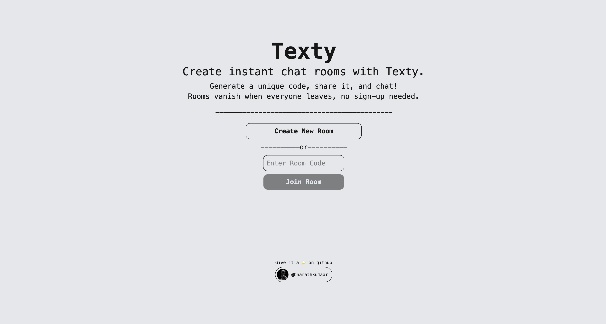

# Texty.
  
Create Instant chat rooms with Texty.  
Generate a unique code, share it, and chat! Rooms vanish when everyone leaves, no sign-up needed. 
 

## Features
- Create a room and get a unique room code.
- Share the code for others to join and chat.
- Real-time messaging using WebSockets.
- Rooms auto-dissolve when empty.
- No signup or login needed.

## Tech stack
Backend: Node.js, Express.js, Socket.IO  
Frontend: React, Tailwind CSS

## Contributing

Feel free to fork this repository, submit issues, or pull requests. Suggestions for extra features are welcome!

